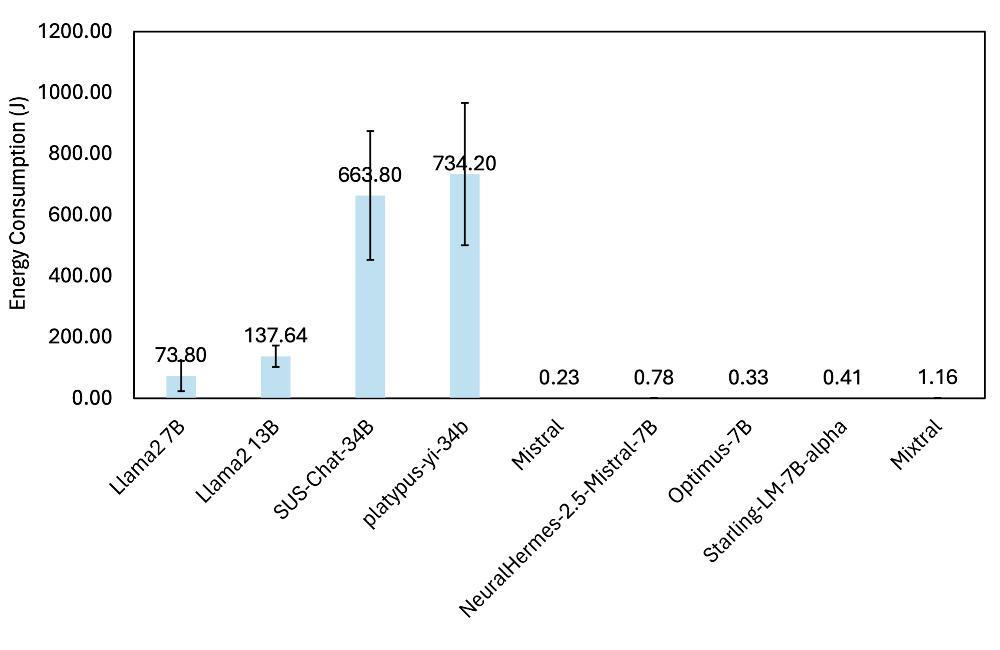
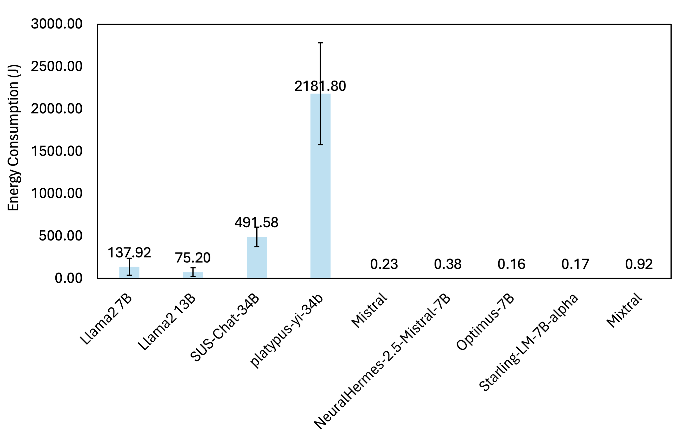
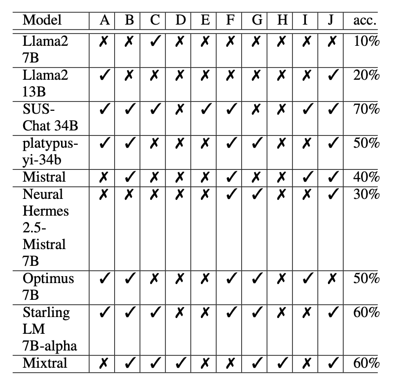
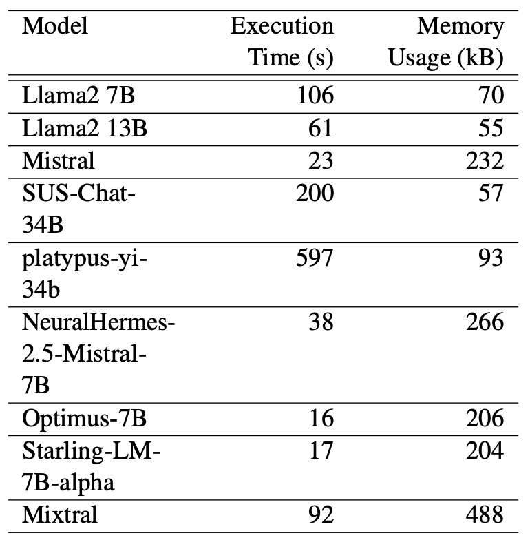
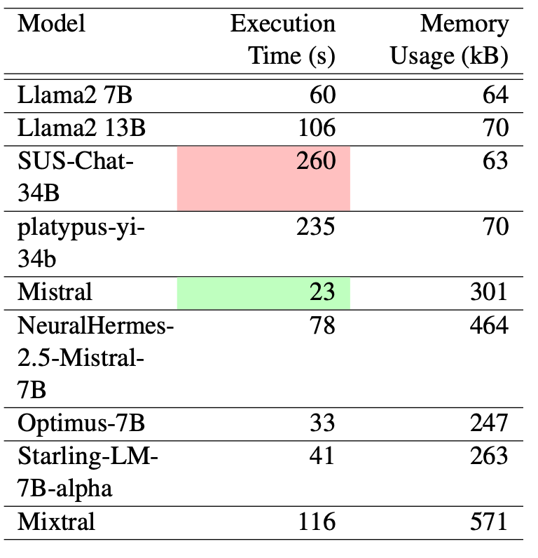

# Can LLMs Substitute SQL? Comparing Resource Utilization of Querying LLMs versus Traditional Relational Databases

## Overview

This repository contains the code and dataset used for the paper **"Can LLMs Substitute SQL? Comparing Resource Utilization of Querying LLMs versus Traditional Relational Databases"** by **Xiang Zhang, Khatoon Khedri, and Reza Rawassizadeh**. The study evaluates the resource utilization and accuracy of large language models (LLMs) in interpreting and executing natural language queries compared to traditional SQL within relational database management systems.

## Citation

If you use this code or dataset in your research, please cite our paper:

**APA Format:**

Xiang Zhang, Khatoon Khedri, and Reza Rawassizadeh. 2024. Can LLMs substitute SQL? Comparing Resource Utilization of Querying LLMs versus Traditional Relational Databases. In *Proceedings of the 62nd Annual Meeting of the Association for Computational Linguistics (Volume 4: Student Research Workshop)*, pages 34–41, Bangkok, Thailand. Association for Computational Linguistics.

**BibTeX:**

```bibtex
@inproceedings{Zhang2024LLMvsSQL,
  title={Can LLMs substitute SQL? Comparing Resource Utilization of Querying LLMs versus Traditional Relational Databases},
  author={Xiang Zhang and Khatoon Khedri and Reza Rawassizadeh},
  booktitle={Proceedings of the 62nd Annual Meeting of the Association for Computational Linguistics (Volume 4: Student Research Workshop)},
  year={2024},
  pages={34--41},
  address={Bangkok, Thailand},
  publisher={Association for Computational Linguistics}
}
```

## Contents

- **LLM_Generation_Comparison.ipynb**: Jupyter notebook containing the implementation of the experiments comparing resource utilization and accuracy between LLMs and SQL queries. The notebook includes:
  - Setup and initialization of LLMs using both Transformers Pipeline and Hugging Face's quantized models.
  - Functions for measuring execution time, CPU, memory usage, and energy consumption of LLMs during SQL query generation and direct query execution.
  - Results and analysis of performance metrics for various LLMs, including Llama2 (7B, 13B), Mistral, Optimus-7B, and others.

- **dataset.csv**: A synthetic dataset representing stock transactions used to evaluate the performance of LLMs and SQL queries. The dataset includes 100 records with attributes such as date, transaction type, stock symbol, quantity, and price.

## Dataset Description

The dataset `dataset.csv` is designed to simulate a real-world scenario of stock transactions, including:

- **Date**: The date of the transaction.
- **Transaction**: The type of transaction (`BUY` or `SELL`).
- **Symbol**: The stock symbol (e.g., AAPL, GOOGL, AMZN, MSFT, TSLA).
- **Quantity**: The number of stocks involved in the transaction.
- **Price**: The price per stock during the transaction.

## Experiment Results

The following figures summarize the key results of our experiments:

### Energy Consumption of LLM Models



*Figure 1: Average energy consumption for direct query results of LLM models.*



*Figure 2: Average energy consumption for SQL query generation using LLM models.*

### Accuracy of Query Generation



*Figure 3: Accuracy of query generation for various LLM models.*

### Execution Time and Memory Utilization



*Figure 4: Average execution time and memory utilization for SQL query generation using LLM models.*


*Figure 5: Accuracy of direct query results generated by various LLM models.*



*Figure 6: Average execution time and memory utilization for direct query results of LLM models.*

## How to Use

1. **Clone the Repository**
   ```bash
   git clone https://github.com/yourusername/LLM_SQL_Comparison.git
   cd LLM_SQL_Comparison

2. **Run the Notebook**
   Open the Jupyter notebook `LLM_Generation_Comparison.ipynb` in your preferred environment (e.g., JupyterLab, VSCode) and run the cells to reproduce the experiments.

3. **Analyze the Results**
   The notebook provides detailed outputs, including execution time, memory consumption, and energy utilization metrics for each LLM model tested. You can modify the notebook to test additional models or datasets as needed.

## Research Implications

Our study demonstrates the significant resource overhead associated with using LLMs for database querying tasks compared to traditional SQL. While LLMs offer flexibility and ease of use, their high energy consumption and longer execution times pose challenges for their practical deployment in resource-constrained environments.

## Future Work

Further research could explore optimizing LLMs for specific database tasks, including fine-tuning models for SQL schema comprehension or developing hybrid methods that combine the strengths of LLMs and traditional SQL engines.

## License

This project is licensed under the MIT License. See the LICENSE file for details.

## Contact

For any questions or collaboration inquiries, please contact:

Xiang Zhang: xz0224@bu.edu  
Khatoon Khedri: khatoon.khedri1985@gmail.com  
Reza Rawassizadeh: rezar@bu.edu
